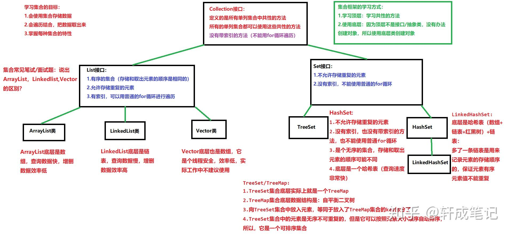
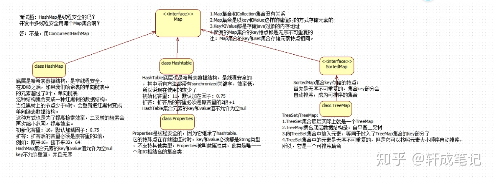
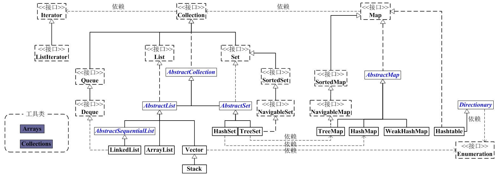
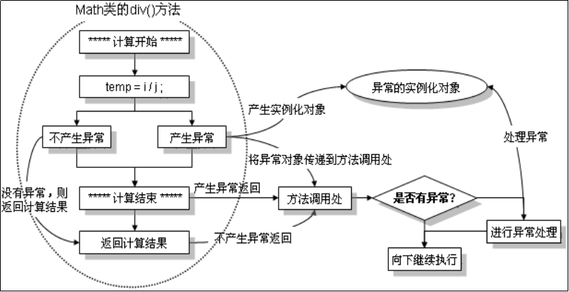

## arraylist

arraylist.sort()可以直接将数组进行排序，数组必须是可修改的数组

## 二维数组

第一个下标表示行，第二个下标表示列


# list接口

string转char[]，s.toCharArray()

```
	Object[] array = ali.toArray();
```

toArray()：用来实现lsit对象转为数组对象的功能


char[]长度用length


ArrayList长度用size


char[] 转string    String s1 = String.valueOf(chars);


## ArrayList<Character>

## stringBuilder

ArrayList<Character>转string时我用这个东西

deleteCharAt

append

toString


# java集合

## 1介绍

为了方便操作多个对象，就要存储多个对象，就要用容器（集合）装。

1.集合只能存放对象，例如int数据放进集合，会自动转换为integer类后存入

2.集合存放的是对象的引用，而非对象的本身，对象本身还是在堆内存中

3.集合可以存放不同的类型，不限量的数据类型

## 1.1集合的三种类型

list 有序列表集合，插入有序，元素可重复

set 保证没有重复元素的集合，插入无序，元素不可重复

map 一种键值对查找的映射表集合

LinkedHashMap,保持插入顺序，HashMap不保持插入顺序，排序选择TreeMap

## 2.集合的分类

list接口

1. LinkedList 接口实现类， 链表， 插入删除， 没有同步， 线程不安全
2. ArrayList 接口实现类， 数组， 随机访问， 没有同步， 线程不安全
3. Vector 接口实现类 数组， 同步， 线程安全（Stack 是Vector类的实现类）

set接口

1. HashSet 使用hash表（数组）存储元素

​	LinkedHashSet 链表维护元素的插入次序

1. TreeSet 底层实现为二叉树，元素排好序



collection接口

​	list接口 

​		arrayList类（数组、查询快、增删效率低）、LinkedList类(链表，查询慢，增删除效率高)、Vector类（数组、线程安全，效率低）

​	set接口  

​		TreeSet、HashSet-->LinkedHashSet



### map

put(K key, V value) 将指定的值与此映射中的指定键关联（可选操作）。

get(Object key) 返回指定键所映射的值；如果此映射不包含该键的映射关系，则返回 null。

containsKey(Object key) 如果此映射包含指定键的映射关系，则返回 true。

keySet() 返回此映射中包含的键的 Set 视图。

entrySet() 返回此映射中包含的映射关系的 Set 视图。



# Java Iterator（迭代器）

Java Iterator（迭代器）不是一个集合，它是一种用于访问集合的方法，可用于迭代 ArrayList 和 HashSet 等集合。

Iterator 是 Java 迭代器最简单的实现，ListIterator 是 Collection API 中的接口， 它扩展了 Iterator 接口。

- **next()** - 返回迭代器的下一个元素，并将迭代器的指针移到下一个位置。
- **hasNext()** - 用于判断集合中是否还有下一个元素可以访问。
- **remove()** - 从集合中删除迭代器最后访问的元素（可选操作。

# 匿名内部类

适合创建那种只需一次使用的类，创建匿名内部类时会立即创建一个该类的实例，这个类的定义立即消失，匿名内部类不能重复使用

```
//定义一个活动接口
interface Action{
    public String eat();
    public String breath();
}
public class Mouth {
    public void use(Action action){
        System.out.println("嘴巴的的用处有"+action.eat()+"和"+action.breath());
    }
	public static void main(String[] args) {
            Mouth myMouth=new Mouth();
            myMouth.use(new Action() {    //实现接口和抽象方法
                @Override
                public String eat() {     
                    return "吃饭";
                }

                @Override
                public String breath() {
                    return "呼吸";
                }
            });
    }
}
```

# Comparable比较器

# String类

substring(int beginIndex, int endIndex)获取子字符串

# 包装类

**装箱**

基本类型变成包装类valueof

**拆箱**

包装类变成基本数据类型xxxvalue

# 泛型

我们希望一个类能够存储多种对象，我们可以使用object，这样就可以存不同的对象了。但是我们希望能够存储同一种类型的对象，我们喜欢暂时不指定类型，稍后决定具体使用什么类型。<T>其中T是类型参数。

```
//泛型定义
class fanxing<T>{
}

public static void main(String[] args) {
		//new一个泛型时输入指定的类型
        fanxing<Integer> integerfanxing = new fanxing<>();
}
```

# 异常

## 1.异常类

在Java体系中异常或者错误类的超级父类：java.lang.Throwable

这个类之下有两个子类，一个是错误类Error  一个是异常类Exception

--Error：程序中的错误，不能被捕获和处理

--Exception：程序中的异常，可以被捕获和处理：运行时异常+非运行时异常

## 2.对异常的处理

--try~catch~finally：是一套完整地处理异常机制，抓抛模型

--throws：声明异常

-throw：手动抛出异常

(1)--try~catch~finally：是一套完整地处理异常机制，抓抛模型

```
  try{
            int div = a/b;     
        }catch(ArithmeticException e){
            System.out.println("算术异常被我捕获了，你肯定用0做除数了！");
        }catch(ArrayIndexOutOfBoundsException e){
            e.printStackTrace();
        }catch(NullPointerException e){
            System.out.println(e);
        }catch(Exception e){//捕获多个异常，细小的异常在粗的异常之前
            System.out.println(e);
        }finally{
            System.out.println("不管是都有异常，都要打印我……");
        }
```

```
try{
	// 有可能出现异常的语句
}catch(异常类 异常对象){
	// 编写异常的处理语句
}
finally{ 
  	//一定会运行到的程序代码
}
```

(2)--throws：声明异常，一般来说可能会方法异常的地方用关键字throws来**标识**可能存在异常，提示调用者处理，一般放在方法后

```
public class Demo02 {
	//只调用不处理，也声明出去，最后是JVM处理
	public static void main(String[] args) throws Exception{
		Math ma = new Math();
		System.out.println(ma.div(10, 5));
	}
}
class Math{
	//此方法可能存在异常-->方法后声明异常，提示调用处处理
	public int div(int a,int b)throws Exception{
		int c = a/b;
		return c;
	}
}
```

(3)-throw：手动抛出异常，一般用于代码存在问题，手动实例化异常对象，便于程序处理

```
public class Demo03 {
	public static void main(String[] args) {
		Girl gg = new Girl();
		try {
			gg.saySorry();
		} catch (Exception e) {
			System.out.println(e);
		}
	}
}
class Girl{
	public void saySorry()throws Exception{
		throw new Exception("给我道歉!");
	}
}
```



(4).自定义异常类

--Java体系提供了很多的异常类，基本可以满足普通程序异常处理，但是若针对具体业务，提供的异常类的提醒就显得不太符合业务，这个时候就需要自己定义一个业务异常类。

getMessage异常原因信息

toString异常信息+异常原因

printStackTrace输出异常信息+异常原因+具体异常的包点类代码行

```
class MyException extends Exception{
	//自定义异常类，在构造方法中调用父类构造即可
	public MyException(String msg){
		super(msg);
	}
}
```

## 3、Object类

 --Object 是类层次结构的根类。每个类都使用 Object 作为超类。所有对象（包括数组）都实现这个类的方法。

--toString() 返回该对象的字符串表示。

--equals(Object obj) 指示其他某个对象是否与此对象“相等”。

判断对象是都相等，默认情况下比较内存地址，可以根据实际情况，

# final关键字

若修饰类，则此类就不能再有子类；若修饰方法，则此方法就不能再被覆写；若修饰变量或属性，则变量属性即为常量。

--public static final修饰定义全局常量

# 接口

--接口就是一个特殊的类，此类只由全局常量和公共抽象方法组成，且用关键字interface定义

--①接口必须被子类继承实现，用关键字implements实现，且接口可以多实现，突破了Java中的单继承

--②子类必须覆写实现接口中的全部抽象方法

--③子类可以同时继承抽象类和实现接口；接口也可以被多继承

继承使用关键字extends

```
interface Lock{
    public abstract void lockUp();
    public abstract void openLock();
}
```

# 多态

--所谓多态：就是同一个事物，根据条件和场景不同，体现出不同的需求功能。

Java中多态有两种实现，①方法的多态；②对象的多态

--**方法多态**

​	--方法重载：同一个类中，方法名称相同，参数类型或参数个数不同，实现不同功能

​	--方法覆写：类的继承关系中，子类重新编写父类中同名方法，方法名称、参数个数、类型等等都一样，但是方法功能不同。

--**对象多态**：就是子类对象实现父类实例 或者 父类对象实现子类实例，存在向上转型和向下转型

--向上转型：就是用子类实例实现父类对象，此过程自动完成

语法：父类 父类对象 = new 子类构造()；

--向下转型：就是用父类实例实现子类对象，此过程需要强制转换

语法：子类 子类对象 = (子类类型)new 父类构造();

# super关键字

--作用：父类中的属性或者调用父类中的方法

--联想：this本类中的属性、方法或表示当前对象

# abstract抽象类

抽象方法只能存在抽象类

--抽象类使用点：

①抽象类必须被子类继承，子类（如果不是抽象类）必须覆写抽象类中的全部抽象方法。

②抽象类可以没有抽象方法，但是抽象方法必须放在抽象类中。
