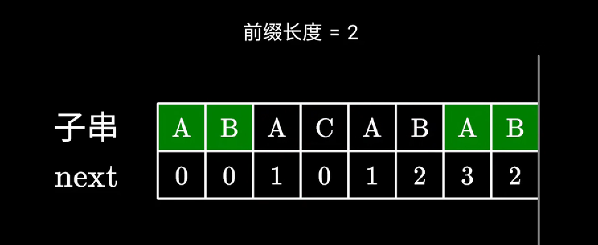
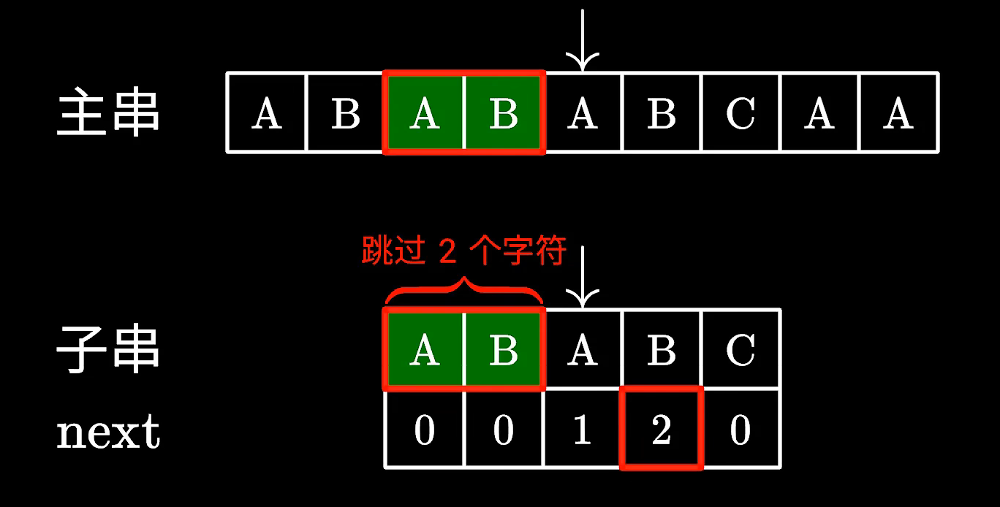

# kmp算法

## 什么是KMP

说到KMP，先说一下KMP这个名字是怎么来的，为什么叫做KMP呢。

因为是由这三位学者发明的：Knuth，Morris和Pratt，所以取了三位学者名字的首字母。所以叫做KMP

## 有什么用

给一个**文本串**：aabaabaaf，给一个**模式串**：aabaaf，判断模式串是否为文本串的子串。暴力法是其中的一个解决方案，但是时间复杂度为o（m*n），所以用kmp算法。

## 前缀和后缀

abc

前缀就是包含首字母，不包含尾字母的 a，ab

后缀就是包含尾字母，不包含首字母的 c，bc

## next数组的计算



next数组是什么，next数组就是一个**前缀表**，就是最长相等前后缀。


如果你问我为什么要这么写，其实我也不是很懂。可以根据上图最后一个b理解为什么要-1。

我觉得就是，如果b和c不匹配，就判断c前面的a，看看在第一个字母开始是否有和a一样的，因为b和c不匹配，但是也说明了，b和c前面的a是匹配的。所以要判断第一个字母是否和b前面的a一样，所以可以根据c前面的a的next数组的值去判断第一个字母是否存在a。然后再对前后两个a的后面的字符进行判断。如果c前面的a的next数组值为0，就是没有一样的，就直接add0就行了。

```
public static ArrayList<Integer> build_next(char[] s){  //s是字符数组
        ArrayList<Integer> next = new ArrayList<>();		//定义一个可扩展数组
        int pre_fix=0;			//这个是共同前后缀长度
        int i=1;
        next.add(0);
        while(i<s.length){
            if(s[i]==s[pre_fix]){    //如果字符相等
                i++;
                pre_fix++;
                next.add(pre_fix);
            } else {				//如果字符不相等
                if(pre_fix==0){		//且前面没有字符相同
                    next.add(0);
                    i++;
                }else{
                    pre_fix=next.get(pre_fix-1);//难理解在这个地方，为什么要-1退回去
                }
            }
        }
        return next;
    }
```

## kpm代码实现



```
    public static int kmp_search(char[] s,int[] patt){
        ArrayList<Integer> next = build_next(s);
        int i=0;    //主串中的指针
        int j=0;    //子串中的指针
        while(i<s.length){
            if(patt[i]==s[i]){  //如果字符相等，指针向前
                j++;
                i++;
            } else if (j>0) {   //看子串中的指针是否为第一个字符，如果不是
                j=next.get(j-1);
            } else{   //如果不是，主指针加一
                i++;  
            }
            if(j== patt.length){   //匹配成功
                return i-j;    //返回字符串启始位置
            }
        }
        return i-j;
    }

```

# 459.重复的子字符串

ababab

字符串s=n*x    x=2  n=3

最长相同前后缀m*x而且n-m=1   m=2   n=3  mx=4

如果nx%(n-m)x=0可以判断有重复子串出现

如果next[len-1]!=-1则说明字符串有最长相等前后缀

最长相等前后缀长度为next[len-1]+1

如果len%(len-(next[len-1]+1))==0 说明该字符串有重复的子字符串

```
class Solution {
    public boolean repeatedSubstringPattern(String s) {
        char[] chars = s.toCharArray();
        ArrayList<Integer> next = build_next(chars);
        int len=s.length();

        // 最后判断是否是重复的子字符串，这里 next[len] 即代表next数组末尾的值
        if (next.get(len-1) > 0 && len % (len - next.get(len-1)) == 0) {
            return true;
        }
        return false;
    }
    
  //这个函数是计算next数组
  public static ArrayList<Integer> build_next(char[] s){
        ArrayList<Integer> next = new ArrayList<>();
        int pre_fix=0;
        int i=1;
        next.add(0);
        while(i<s.length){
            if(s[i]==s[pre_fix]){
                i++;
                pre_fix++;
                next.add(pre_fix);
            } else {
                if(pre_fix==0){
                    next.add(0);
                    i++;
                }else{
                    pre_fix=next.get(pre_fix-1);
                }
            }
        }
        return next;
    }
}
```

#  28. 实现 strStr()

经典的kmp算法使用

```
class Solution {
      public int strStr(String haystack, String needle) {
        char[] hay = haystack.toCharArray();    //主串
        char[] nee = needle.toCharArray();      //子串
        ArrayList<Integer> next = build_next(nee);
        int i=0;//主串指针
        int j=0;//子串指针
        while(i<hay.length){
            if(hay[i]==nee[j]){  //相等就全部指针加一
               i++;
               j++;
            }else if(j>0){
                j=next.get(j-1);
            }else{
                i++;
            }
            if(j==nee.length){
                return i-j;
            }
        }
        return -1;
    }

    //next
    public ArrayList<Integer> build_next(char[] s){
        ArrayList<Integer> next = new ArrayList<>();
        int pre_fix=0;
        int i=1;
        next.add(0);
        while(i<s.length){
            if(s[pre_fix]==s[i]){
                pre_fix++;
                i++;
                next.add(pre_fix);
            }else{
                if(pre_fix==0){
                    next.add(0);
                    i++;
                }else{
                    pre_fix= next.get(pre_fix-1);
                }
            }
        }
        return next;
    }
}
```

# 151.翻转字符串里的单词


```
 public static String reverseWords(String s) {
        char[] chars = s.toCharArray();
        int i= chars.length-1;    //原数组指针
        StringBuilder stringBuilder = new StringBuilder();
        ArrayList<Character> a = new ArrayList<>();  

        while(i>=0){   //原数组遍历
            if(chars[i]==' '){  //如果为空
                i--;
            }else{       //不为空，遍历这组单词
                while(i>=0 && chars[i]!=' '){  //当为空时停止
                    a.add(chars[i]);
                    i--;
                }
                a = reserve(a);//反转单词
                for (Character character : a) {
                    stringBuilder.append(character);
                }
                stringBuilder.append(" ");
                a.clear();
            }
        }
        return stringBuilder.deleteCharAt(stringBuilder.length()-1).toString();
    }


    public static ArrayList<Character> reserve(ArrayList<Character> chars){
        char mid;
        int j=chars.size()-1;
        for(int i=0;i<chars.size()/2;i++){
            mid = chars.get(i);
            chars.set(i,chars.get(j));
            chars.set(j,mid);
            j--;
        }
        return chars;
    }
```

