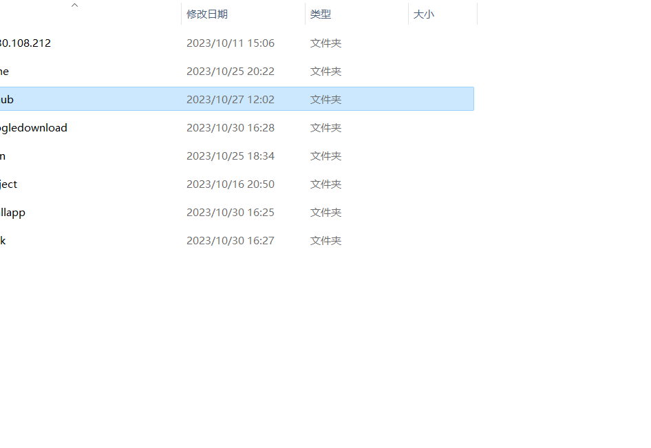

# 内排序


## 时间复杂度




## 插入排序

```
/**7.2插入排序
 * 
 * 7.2.1直接插入排序
 * 在一堆数中，我们先把第一个数当做一个数组
 * 接下来依次把第二个第三个数插入到数组里
 * 插入到数组中需要排序，就一个一个查找
*/

/**
 * 算法7-1  不带监视哨的直接插入排序
*/
void sort_insert_1(sqlist &l){
    int i,j;
    for(i=2;i<l.length;i++){         //因为0是没有值的，我们直接从2开始，1已经在数组里面了
        redtype temp = l.r[i];       //先把要插入的值存入temp，因为后面移动时会覆盖掉l.r[i]

        /**
         * 将temp与里面的小数组的数依次比较。
         * 内部小数组比外部数组少一个所以是j-1，从后面开始查起
         * temp.key < l.r[j].key   差不多就是a[4]<a[i]  i=(3,2,1)的意思
         * 如果3比4大，那么就用3把四覆盖掉，继续用3跟temp比较
         * 到最后就是用temp就是j+1的位置
         * 
         * 用j>=1来控制下标越界，可能是让j不能等于0，因为他是倒序的
        */
        for(j=i-1;j>=1&&temp.key < l.r[j].key;j--){       
            l.r[j+1]=l.r[j];
        }
        l.r[j+1]=temp;
    }
}
```

## 希尔排序

```
/**
 * 7.2.2希尔排序
 * 待排序序列分成若干个子序列，然后分别进行插入排序的方法
 * 
*/

void sort_shell(sqlist &l,int dk){
    int i,j;
    for(i=1+dk;i<l.length;i++){
        if(l.r[i].key<l.r[i-dk].key){    //如果前面的大于后面的
            l.r[0]=l.r[i];
            l.r[i]=l.r[i-dk];
            for(j=i-2*dk;l.r[0].key<l.r[j].key;j-=dk){     //我还是不能明白为什么j=i-2*dk这里算出来的是负数
                l.r[j+dk]=l.r[j];      //这样会出现两个l.r[j]然后方便0插入
            }
            l.r[j]=l.r[0];
        }
    }
}

void sort_shell(sqlist &l,int dlta[],int t){
    for(int a=0;a<t;a++){
        sort_shell(l,dlta[a]);    
    }
}
```

## 快速排序

```
//7.3.2快速排序
/**
 * 取出一个数，在数列里用两个指针左和右，左指针开始移动和取出的数进行比较
 * 你会发现自己根本用语言描述不了，建议去看视频
*/

//算法7-5这是一趟快速排序  快速排序要实现多次排序
int partition(sqlist &l,int low,int high){
    
    l.r[0]=l.r[low];       //将要比较的数存储于0
    int pivotloc=l.r[low].key;

    while(low<high){          //整体的循环
        while(low<high&&l.r[high].key >= pivotloc){    //右指针--到有个数被移动时才停止
            high--;                                     
        } 
        //就是把小的移动到low那个位置
        if(low<high){          
            l.r[low++]=l.r[high];          //这里是l.r[low]=l.r[high];  用完之后再加 
        }

        while(low<high&&l.r[low].key <= pivotloc){    //左指针一样
            low++;
        }
        if(low<high){
            l.r[high--].key=l.r[low].key;   //同理
        } 
    }
    l.r[low]=l.r[0];    //将比较拿出去的数归还到数组
    return 0;
}

//算法7-6递归快速排序算法
void sort_quick(sqlist &l,int high,int low){
    if(low<high){
        int pivotloc=partition(l,low,high);  //先完成一次排序，确定枢纽位置
        sort_quick(l,low,pivotloc-1);
        sort_quick(l,pivotloc+1,high);
    }
}

```

## 直接选择排序

```

//7.4.1直接选择排序
//算法7-8直接选择排序


/**
 * 算法7-8-1简单选择排序
 * 在一排数中，选择最小的数和第一个数进行交换
 * 然后第二个数开始，选择后面最小的数和第二个数进行交换
*/
void selectsort(sqlist &l){
    //对顺序表进行简单选择排序
    int i;
    for(i=0;i<l.length;i++){
        int k=i;     //k算是一个指针，指向那个要被交换的数，比如说第一次就是第一个
        int j;
        for(j=i+1;j<l.length;j++){
            if(l.r[k].key > l.r[j].key){
                k=j;                         //这里令k为最小值的指针
            }
        }
        if(k!=i){     //如果i不是最小，将结点进行交换
            redtype q;
            q = l.r[i];
            l.r[i]=l.r[k]; 
            l.r[k]=q;
        }
    }
}
```

